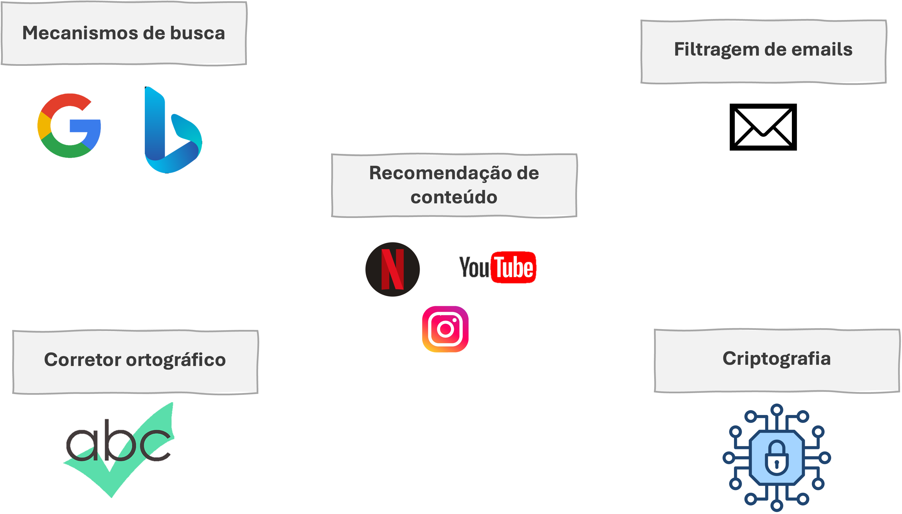
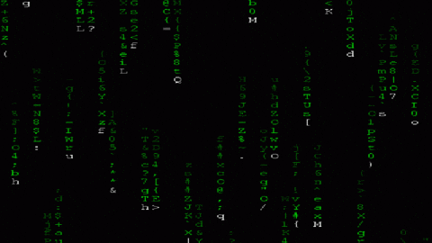
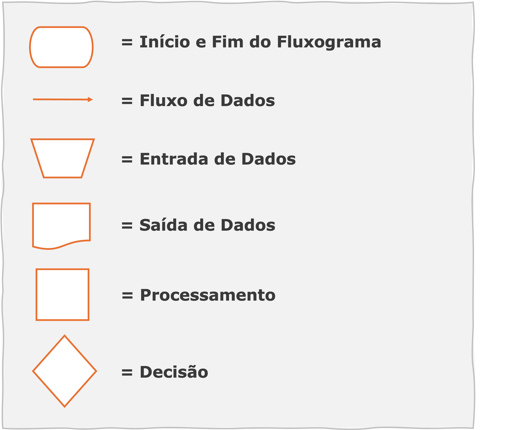
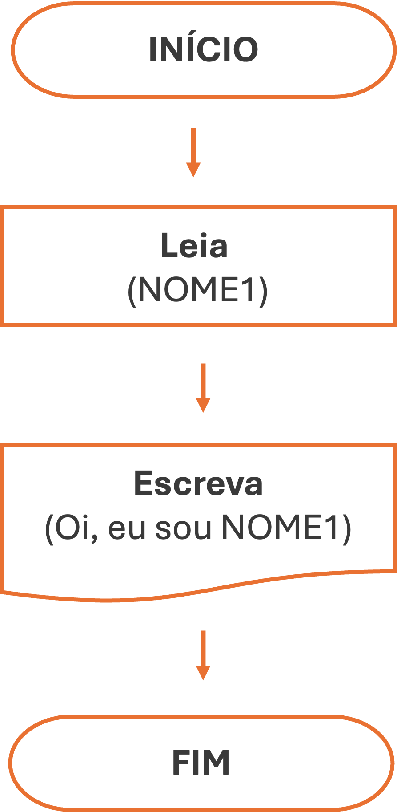
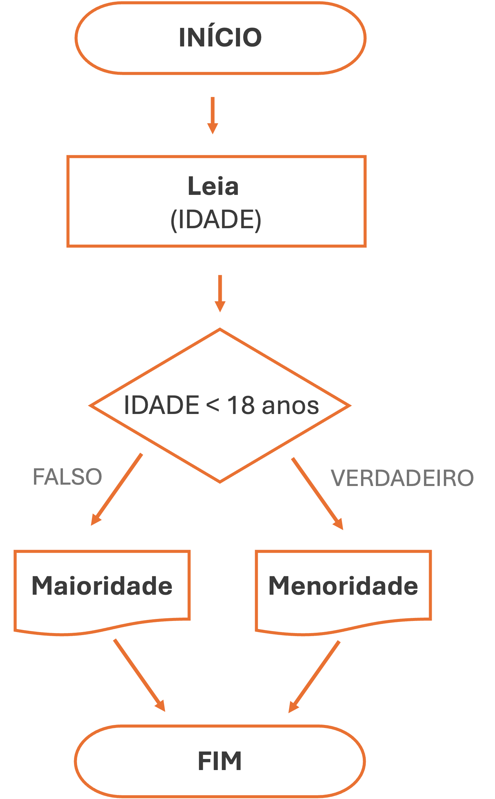
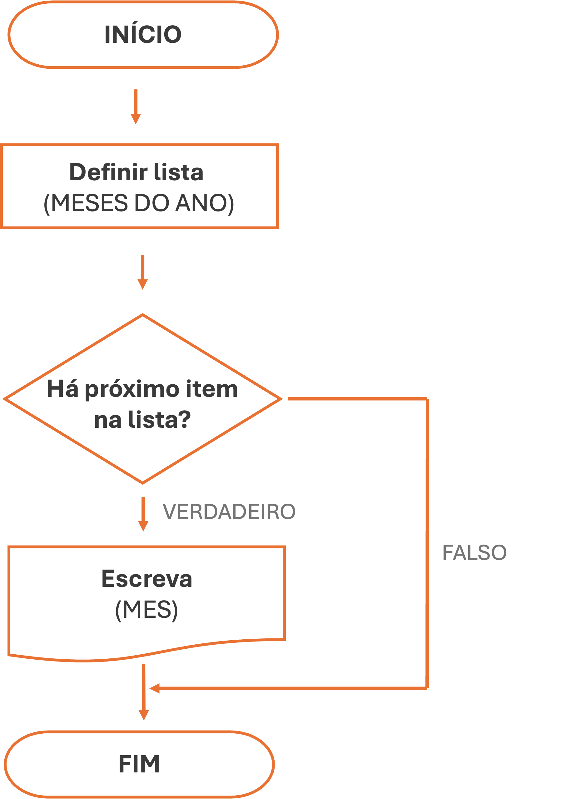
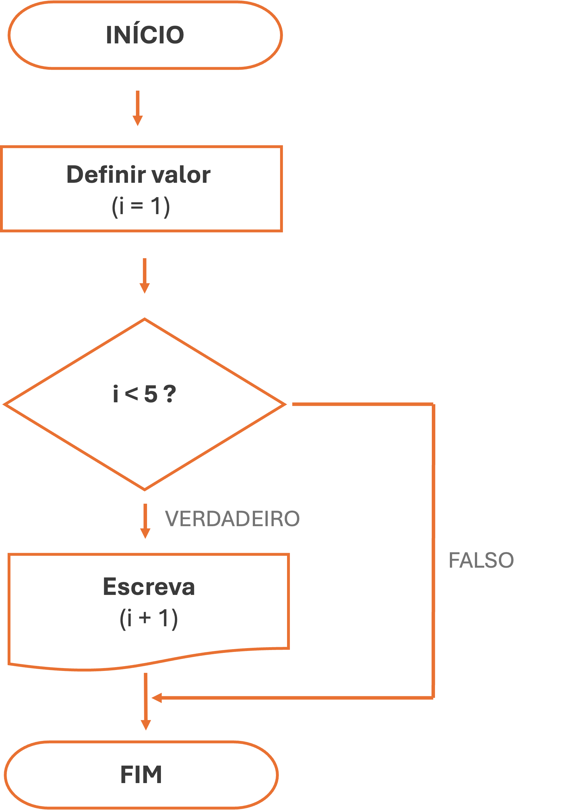

class: inverse, center, middle

# Algoritmos

---

# Algoritmos

<br>

São conjuntos de instruções lógicas e sequenciais para realizar uma tarefa ou resolver um problema

--


.pull-left[
```{r, echo=F, message=F, warning= F}

library(dplyr)
library(kableExtra)

data_table <- data.frame(
  Passo = 1:9,
  Descricao = c(
    "Desligar o carro",
    "Pegar as ferramentas",
    "Pegar o estepe",
    "Suspender o carro com o macaco",
    "Desenroscar os 4 parafusos do pneu furado",
    "Colocar o estepe",
    "Enroscar os 4 parafusos",
    "Baixar o carro com o macaco",
    "Guardar as ferramentas"
  )
)

```


```{r echo=F}
data_table %>%
  kable(booktabs = TRUE,
        format = "html",
        col.names = NULL, 
        caption = "Algoritmo de troca de pneu") %>%
  kable_paper(bootstrap_options = c("striped","hover", "condensed"), full_width = F) %>%
  kable_classic() %>%
  kable_styling(font_size = 20)
```

]


.pull-right[

<br>
<br>
<br>

**Funcionam como uma receita de bolo**

]

---

# Algoritmos

<br>


São capazes de realizar tarefas como:
- Ler, manipular e criar dados
- Avaliar expressões algébricas, relacionais e lógicas
- Tomar decisões com base nos resultados das expressões avaliadas
- Repetir um conjunto de ações de acordo com uma condição

<br>

--

Baseados em algumas premissas básicas:
- **Finitude:** Deve ter um número limitado de etapas e resolver o problema
- **Clareza:** As etapas são definidas de forma simples, sem ambiguidade e de forma ordenada 
- **Efetividade:** Deve sempre solucionar o problema, antecipando possíveis falhas; codificado de forma simples e eficiente

---

# Algoritmos


Os algoritmos permeiam diferentes esferas do cotidiano

<br>

```{r echo=FALSE, out.width ="85%", fig.align ='center'}

```


---
# Algoritmos

<br>


```{r echo=FALSE, out.width ="100%", fig.align ='left'}

```


---

# Algoritmos

<br>

.pull-left[

<br>

Os algoritmos são típicamente compostos por três partes:

  1. Entrada de dados (*input*)
  2. Processamento dos dados
  3. Saída de dados (*input*)

--------

Podem ser representados por um **fluxograma** - ilustração gráfica de um algoritmo

]

.pull-right[

<br>

```{r echo=FALSE, out.width ="100%", fig.align ='center'}

```

]

---

# Algoritmos

<br>
<br>

.pull-left[


```{r echo=FALSE, out.width ="100%", fig.align ='center'}

```

]

.pull-right[

O fluxograma é composto por uma série de controles que definem a ordem de execução das etapas do algoritmo
  >  **Controles de fluxo**

-------

Controles de fluxo podem ser divididos em duas categorias:
- **Condicionantes:** permitem a realização de decisões
- **Iteradores:** permitem a repetição de determinadas sequências

]


---

# Algoritmos

### <span style="color: #ee6c4d;">**Condicionantes** </span>

<br>

Permite que o algoritmo execute diferentes etapas baseadas em condições lógicas (TRUE/FALSE)
  - É o mecanismo que faz o computador tomar decisões dependendo de uma determinada condição

  - Na programação: `if, if-else`

---

# Algoritmos

### <span style="color: #ee6c4d;">**Condicionantes** </span><span style="color: #3e5c76;">| <i>if</i>  </span> 

Segue uma estrutura sequencial (Se...)

.pull-left[
```{r echo=FALSE, out.width ="40%", fig.align ='center'}

```

]

.pull-right[

**Exemplo no R**

```{r echo = T}

NOME <- "Morpheus"

if(is.character(NOME)){
  print(paste("Oi, eu sou o", NOME))
}


```

]


---

# Algoritmos

### <span style="color: #ee6c4d;">**Condicionantes** </span><span style="color: #3e5c76;">| <i>if-else</i>  </span> 

Segue uma estrutura alternada (Se...então...)


.pull-left[
```{r echo=FALSE, out.width ="55%", fig.align ='center'}

```

]

.pull-right[

**Exemplo no R**

```{r echo = T}

IDADE <- 15

if(IDADE > 18){
  print("Você é de maioridade")
} else{
  print("Você é de menoridade")
}


```

]


---

# Algoritmos

### <span style="color: #ee6c4d;">**Iteradores** </span>

<br>

Permitm que o algoritmo execute um mesmo bloco de código várias vezes, de forma automatizada
- Conhecido como *loops* (*laços*, em português)
- Na programação: `for, while`


--

<br>

Muitas vezes associado aos seguintes comandos auxiliares:
- `break`: interrompe a execução do loop
- `next`: pula a iteração atual e continua com a próxima iteração


---

# Algoritmos

### <span style="color: #ee6c4d;">**Iteradores** </span><span style="color: #3e5c76;">| <i>for</i>  </span> 

<br>

Utilizado para fazer os *loopings*, isto é, repetir uma mesma tarefa para um conjunto de valores diferentes
- Cada repetição é chamada de **iteração** e o objeto que muda de valor em cada iteração é chamado de **iterador**

---

# Algoritmos

### <span style="color: #ee6c4d;">**Iteradores** </span><span style="color: #3e5c76;">| <i>for</i>  </span> 


.pull-left[
<br>

```{r echo=FALSE, out.width ="75%", fig.align ='center'}

```

]

.pull-right[

**Exemplo no R**

```{r echo = T}

MESES <- month.name

for(i in seq_along(MESES)){
  print(MESES[i])
}

```

]


---


# Algoritmos

### <span style="color: #ee6c4d;">**Iteradores** </span><span style="color: #3e5c76;">| <i>while</i>  </span> 

Similar ao iterador *for*, porém o *loop* é executado apenas enquanto a condição for verdadeira

.pull-left[

```{r echo=FALSE, out.width ="65%", fig.align ='center'}

```

]

.pull-right[

```{r echo = T}

i <- 1

while (i < 5){
  print(i)
  i <-  i + 1
}

```


]

---

# Algoritmos

### <span style="color: #ee6c4d;">**Iteradores** </span><span style="color: #3e5c76;">| <i>break & next</i>  </span> 


**Break**

Usado para encerrar imediatamente a execução de um *loop* (for/while)
- útil quando se atinge uma condição e não há necessidade de continuar iterando pelo resto do loop
  - Economiza tempo de processamento
  - Útil para detectar erros no código (*bugs*)


--

----

**Next**

Usado para pular a iteração atual de um *loop* e prosseguir diretamente para o início da próxima iteração
- Útil quando se deseja ignorar uma parte do *loop*  
  - Economiza tempo de processamento

---


# Algoritmos

### <span style="color: #ee6c4d;">**Iteradores** </span><span style="color: #3e5c76;">| <i>break & next</i>  </span> 


---

# Algoritmos

### <span style="color: #ee6c4d;">**Iteradores** </span><span style="color: #3e5c76;">| <i>break & next</i>  </span> 

.pull-left[

**Break**
```{r}
VALORES <- 1:5
VALORES

for (i in VALORES){
  print(i)
  if (i == 3){
    print("Parou no 3")
    break}}

```


]

--

.pull-right[

**Next**
```{r}
IDADES <- sample(1:80, 5)
IDADES

for(i in IDADES){
  if(i <= 18){
    print(paste(i, "é menor de idade"))
    next }
  print(paste(i, "é maior de idade")) }
```


]