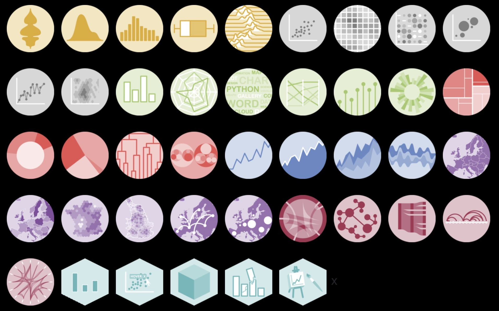

```{r setup, include=FALSE}

library(kableExtra)
library(dplyr)

```

<!--- CSS box customization -->
<style>
p.comment {
background-color: #F9DCC4;
padding: 10px;
border: 1px solid black;
margin: 25px;
border-radius: 5px;
}
</style>


## <span style="color: Tomato;">Conteúdo programático </span> 

<br>

-  __1. Tipos de variáveis__ 

-  **2. Estrutura de dados** 

-  **3. Operadores**  

-  **4. Funções**  

-  **5. Manipulação de dados** 

-  **6. Visualização de dados** 


---
class: inverse, center, middle

# Tipos de variáveis

---

# Tipos de variáveis
<br>

- O R opera em estrutura de <span style="color: Tomato;"> *dados nomeados* </span>

--

    -   Também conhecido por __objetos__ ou __variáveis__
    
--
    
    -   Armazenamento & manipulação dos dados (ou resultados de análises)

--
<br>

- Existem 3 formas de se atribuir uma informação a um objeto:

--

```{r}

# Operador de atribuição (à esquerda)
obj1 <- c(1, 2, 3) 


# Operador de atribuição (à direita)
c(1, 2, 3)  -> obj2


# Operador de atribuição (igualdade)
obj3 = c(1, 2, 3)

```


---


# Tipos de variáveis
<br>

- O nome atribuído ao objeto precisa __sempre__ começar com uma letra (A-Z, a-z)

```{r}

# Letras minúsculas
obj <- c("Marie Curie", "Einstein", "Niels Bohr")

# Letras maiúsculas
OBJ <- c("Marie Curie", "Einstein", "Niels Bohr")

# Letras minúsculas & maiúsculas
oBj <- c("Marie Curie", "Einstein", "Niels Bohr")

```

<br>

--

<p class="comment">
<b> O que acontece se tentarmos atribuir um número como nome do objeto? </b> 
</p>


---

# Tipos de variáveis
<br>

```{r, error = TRUE}

01 <- c("Marie Curie", "Einstein", "Niels Bohr")
```


--

<br>

- O nome dos objetos pode conter *números*, *ponto* (.), ou *underscore* (_)

<br>

--

```{r}

meu_obj_1 <- "O R é massa!"

```


---
# Tipos de variáveis
<br>

- <span style="color: Tomato;">**É importante lembrar que o R é uma linguagem _case-sensitive_ **</span> 

    - <span style="color: Tomato;">OBJ $\neq$ obj</span> 


--

```{r}

obj <- c("Marie Curie", "Pierre Curie")
obj

OBJ <- c("Pierre Curie", "Marie Curie")
OBJ

```

--


```{r}
isTRUE(obj == OBJ)
```


---

# Tipos de variáveis
<br>

- O nome do objeto não deve coincidir com o nome de funções (pré-) carregadas ou nomes reservados exclusivamente para programação:

    - sum
    - mean
    - if/else
    - function
    - TRUE/FALSE
    - ...


---

class: inverse, center, middle

# Estrutura dos dados

---

# Estrutura dos dados
<br>


- Os objetos (i.e., variáveis) podem ser classificados de acordo com a natureza dos elementos que compõem os dados:


```{r echo=F}


df <- data.frame(
  Variável = c("Integer", "Numeric", "Character", "Factor", "Logical", "Date", "Missing"),
  Tipo = c(
    "Formada por números inteiros",
    "Formada por números com casas decimais",
    "Formada por texto sem categorias e estrutura implícita",
    "Formada por textos com categorias bem definidas",
    "Formado por valores booleanos",
    "Formadas por valores temporais",
    "Não há nenhuma informação atribuída à variável"
  ),
  Exemplo = c(
    paste(c("1", "300", "-60"), collapse = ", "),
    paste(c("3.2", "18.5", "-0.9"), collapse = ", "),
    paste(c("Gato", "Dinamarca", "CNPq"), collapse = ", "),
    paste(c("Manhã", "Tarde", "Noite"), collapse = ", "),
    paste(c("TRUE", "FALSE"), collapse = ", "),
    paste(c("2025", "2025-05-26", "2025-05-26 16:35"), collapse = ", "),
    paste(c("NA (Not Available)"), collapse = ", ")
  )
)

```

```{r, echo =F}

kable(df, format = "markdown",
      caption = "Tipos de variáveis", digits = 3)  %>%
  kable_styling("striped", full_width = F) %>%
  #kable_paper(bootstrap_options = "striped", full_width = F) %>%
  kable_classic() 

```

---
# Estrutura dos dados
<br>

- Para avaliar a natureza do objeto, pode-se utilizar a função `class()`

--

```{r echo=T}

var1 <- c("Olá")
class(var1)

var2 <- pi
class(var2)

var3 <- TRUE
class(var3)

```

---
# Estrutura dos dados
<br>

- Para avaliar a natureza do objeto, pode-se utilizar a função `class()`

    - Alternativamente, pode-se avaliar se o objeto é de uma natureza X usando a sintaxe `is.NATUREZA_DO_OBJETO()`:
    
```{r echo=T}
    
    ## Var1 é de natureza fator?
    is.factor(var1)
    
    ## Var2 é de natureza numérica?
    is.numeric(var2)
    
    ## Var3 é de natureza lógica?
    is.numeric(var3)
    
    
```

---
# Estrutura dos dados
<br>

- De modo similar, é possível alterar a natureza do objeto usando funções base conforme:


--
.pull-left[
```{r echo = T}

## Transformando caractere para fator
periodo <- c("Manhã", "Tarde", "Noite")
class(periodo)
periodo <- as.factor(periodo)
class(periodo)

```
]


.pull-right[

**Exemplos**

`as.numeric()`
`as.integer()`
`as.charachter()`
`as.factor()`
`as.logical()`

]


---

# Estrutura dos dados
<br>

- O objeto também podem ser classificado de acordo com sua dimensão

    - quando contém apenas __um elemento__, o objeto é classificado como <span style="color: Tomato;">**variável atômica (scalar)** </span> 

    

.pull-left[

```{r echo=FALSE, out.width ="50%", fig.align ='center'}
knitr::include_graphics("Figuras/scalar.png")
```

]

.pull-right[

```{r}

# Isso tudo é um scalar com
# apenas 1 elemento

s1 <- 1 #integer

s2 <- "Oi" #character

s3 <- TRUE #logical

```

]


---

# Estrutura dos dados
<br>

- O objeto também podem ser classificado de acordo com sua dimensão

    - quando contem __+1 elemento__, o objeto pode ser  classificado de acordo com sua <span style="color: Tomato;">**dimensão** </span> e <span style="color: Tomato;">**natureza** </span>
    
---
# Estrutura dos dados

### <span style="color: Tomato;">Vetor </span> 
<br>


- Conjunto de elementos do mesmo tipo (numérico, lógico, caractere etc.)

    - **1D**
    
.pull-left[

```{r echo=FALSE, out.width ="23%", fig.align ='center'}
knitr::include_graphics("Figuras/vetor.png")
```

]
.pull-right[

```{r}

# Vetor numérico
v1 <- c(1, 35, 110)

## Vetor caractere
v2 <- c("A", "B", "C")

## Vetor lógico
v3 <- c(TRUE, TRUE, FALSE)

```

]

---
# Estrutura dos dados

### <span style="color: Tomato;">Matriz </span> 
<br>

- Representa dados no formato de tabela com linhas e colunas
    
    - **2D**


.pull-left[

```{r echo=FALSE, out.width ="50%", fig.align ='center'}
knitr::include_graphics("Figuras/matriz.png")
```

]
.pull-right[

```{r}

m <- matrix(data = letters[1:6], 
            nrow = 2,
            ncol = 3)
m
```

]

---
# Estrutura dos dados

### <span style="color: Tomato;">Array </span> 

- Extensão da matriz para **+2D**


.pull-left[

```{r echo=FALSE, out.width ="60%", fig.align ='center'}
knitr::include_graphics("Figuras/matriz.png")
```

]
.pull-right[

```{r}

# Array de 2 matrizes 2x2
a <- array(1:8, dim = c(2, 2, 2))  
a

```

]

---
# Estrutura dos dados

### <span style="color: Tomato;">Data frame </span> 

- Similar a uma matriz, porém as colunas podem pertencer à variáveis de naturezas distintas

    - **2D**
    
.pull-left[

```{r echo=FALSE, out.width ="60%", fig.align ='center'}
knitr::include_graphics("Figuras/dataframe.png")
```

]
.pull-right[

```{r}

df <- data.frame(Nome = c("Ana", "Beto"), 
                 Idade = c(25, 16),
                 Maioridade = c(TRUE, FALSE))

df
```

]


---
# Estrutura dos dados

### <span style="color: Tomato;">Lista </span> 

- Coleção de elementos de qualquer tipo e formato (inclusive outras listas)

    - tipo especial de vetor que aceita objetos como elementos


.pull-left[

```{r echo=FALSE, out.width ="60%", fig.align ='center'}
knitr::include_graphics("Figuras/lista.png")
```

]
.pull-right[

```{r}

l <-  list(rep(1, 10), #vetor
           factor(c("vermelho", "azul", "verde")), #fator
           matrix(c(1, 2), c(1, 2))) #matriz
l
```

]


---

class: inverse, center, middle

# Estrutura dos dados
------------
## <center> Prática </center>

---


class: inverse, center, middle

# Operadores

---

# Operadores
<br>


- São símbolos (ou combinações de símbolos) que realizam operações específicas sobre variáveis

--

    - usados para fazer *cálculos*, *comparações*, e diversos tipos de *manipulações* 


--

- Podem ser agrupados em __4 tipos__ básicos:


---
# Operadores

### <span style="color: Tomato;">Aritmético </span> 

<br>

```{r echo=F}

df2 <- data.frame(Operador = c("+", "-", "*", "/", "^ ou **", "%%", "%/%"),
                 Descrição = c("Adição", "Subtração", "Multiplicação", "Divisão", "Potência", "Resto da divisão", "Divisão inteira"))

```


```{r echo=F}

kable(df2, format = "markdown", align = "cc",
       digits = 3)  %>%
  kable_styling("striped", full_width = T) %>%
  #kable_paper(bootstrap_options = "striped", full_width = F) %>%
  kable_classic() 


```


---
# Operadores

### <span style="color: Tomato;">Relacional </span> 

<br>

```{r echo=F}

df3 <- data.frame(Operador = c(">", "<", ">=", "<=", "==", "!="),
                 Descrição = c("Maior", "Menor", "Maior ou igual", "Menor ou igual", "Igualdade", "Diferença"))

```


```{r echo=F}

kable(df3, format = "markdown", align = "cc",
       digits = 3)  %>%
  kable_styling("striped", full_width = T) %>%
  #kable_paper(bootstrap_options = "striped", full_width = F) %>%
  kable_classic() 
```


---

# Operadores

### <span style="color: Tomato;">Lógico </span> 

<br>

```{r echo=F}

df4 <- data.frame(Operador = c("!", "&", "|", "&&", "||", "!="),
                 Descrição = c("Não", "E (elementar)", "Ou (elementar)", "E", "Ou", "Diferente de"))

```


```{r echo=F}

kable(df4, format = "html", align = "cc",escape = FALSE) %>%
  kable_styling("striped", full_width = T) %>%
  #kable_paper(bootstrap_options = "striped", full_width = F) %>%
  kable_classic()
```

---
# Operadores

### <span style="color: Tomato;">Especiais </span> 

<br>

```{r echo=F}

df5 <- data.frame(Operador = c("%in%", ":", "%*%"),
                 Descrição = c("Testa se um elemento pertence a um vetor", "Sequência de números inteiros", "Produto matricial"))

```


```{r echo=F}

kable(df5, format = "markdown", align = "cc",escape = FALSE)  %>%
  kable_styling("striped", full_width = T) %>%
  #kable_paper(bootstrap_options = "striped", full_width = F) %>%
  kable_classic() 
```


---

class: inverse, center, middle

# Operadores
------------
## <center> Prática </center>

---

class: inverse, center, middle
# Funções


---

# Funções
<br>


-  São códigos preparados para executar tarefas específicas

--

    - <span style="color: Tomato;">Funções internas </span> (vem pré-carregadas com o R) 
    - <span style="color: Tomato;">Funções externas </span> (elaboradas pelo próprio usuário)

--

<br>

- Estrutura da função:

    - **Nome da função:** usado para chamar a função (normalmente refere ao que ela faz)
    - **Argumentos:** valores de entrada com as quais a função atuará
    - **Corpo:** conjunto de instruções que define o que a função faz.
    - **Retorno:** valor(es) produzido pela função; caso omitido, o R retorna automáticamente o último valor avaliado


---
# Funções
<br>

### <span style="color: Tomato;">Exemplo </span> 

<br>


```{r, echo=T}

# Função de conversão de temperatura
farenheit_to_celsius <- function(Temperatura = VALOR){
  
  tempC <- (Temperatura - 32) * (5/9)
  
  return(tempC)

}


```

---
<br>

### <span style="color: Tomato;">Exemplo </span> 

<br>


```{r}
# Testando a função
farenheit_to_celsius(82) #Converte um valor
farenheit_to_celsius( c(82, 33, 110) ) #Converte múltiplos valores
```


---
# Funções
### <span style="color: Tomato;">Internas </span> 

- O R possui uma série de funções que já vem com a instalação do programa, a exemplo:

    - **Estatística descritiva**

      - `mean()`: calcula a **média** de um vetor *numérico*
      - `median()`: calcula a **mediana** de um vetor *numérico*
      - `sd()`: calcula o **desvio padrão** de um vetor *numérico*
      - `sum()`: **soma os elementos** de um vetor *numérico*
      - `var()`: calcula a **variância** de um vetor *numérico*
      - `min() / max()`: retorna o valor **mínimo** ou **máximo** de um vetor *numérico*
      - `range()`: retorna simultaneamente o valor mínimo e máximo de um vetor *numérico*
      - `summary()`: retorna um resumo estatísitco de um vetor *numérico*
      

---
# Funções
### <span style="color: Tomato;">Internas </span> 

- O R possui uma série de funções que já vem com a instalação do programa, a exemplo:

    - **Manipulação de matrizes/data frames**
    
      - `length()`: conta o **número de elementos** de um vetor
      - `ncol() / nrow()`: retorna o número de **colunas** ou **linhas**
      - `head() / tail()`: retorna as **5 primeiras** ou **últimas** linhas
      - `dim()`: retorna a **dimensão** (no. linhas e colunas)
      - `colnames() / rownames()`: retorna o **nome** das **colunas** ou **linhas**
      - `str()`: retorna a **estrutura interna**
      - `unique()`: retorna os **valores únicos**
      - `sort()`: **ordena** os valores de um vetor
      - `subset()`: **filtra** linhas e/ou seleciona colunas 
      - `cbind() / rbind()`: **combina** colunas ou linhas de diferentes objetos


---
# Funções
### <span style="color: Tomato;">Internas </span> 

- O R possui uma série de funções que já vem com a instalação do programa, a exemplo:

    - **Visualização dos dados**

      - `plot()`: cria gráficos bidimensionais
      - `hist()`: cria histogramas
      - `boxplot()`: cria um boxplot
      - `barplot()`: cria gráficos de barra
      - `pie()`: cria gráficos de pizza

<br>


---

# Funções
### <span style="color: Tomato;">Internas </span> 

- O R possui uma série de funções que já vem com a instalação do programa, a exemplo:

    - **Misc**     
      
      - `seq()`: cria uma sequência de números
      - `rep()`: replica os valores quantas vezes desejado
      - `c()`: combina elementos de um vetor
      - `apply()`: aplica uma função à linhas ou colunas de uma matriz/data.frame
      - `lapply()`: aplica uma função a cada elemento de uma lista ou vetor
      - `tapply()`: aplica uma função a subgrupos definidos por um fator
      - `sapply()`: similar à função *lapply*, porém retorna um vetor nomeado (ao invés de uma lista)
      - `ifelse()`: similar à função *lapply*, porém retorna um vetor nomeado (ao invés de uma lista)
      

---
# Funções
<br>

- Funções podem ser aninhadas

    - Mais de uma função usada *simultaneamente*

<br>

--


```{r echo=T}

valores <- c("5", "70", "120") #Vetor de caracteres

mean(as.numeric(valores))


```


---

class: inverse, center, middle

# Funções
------------
## <center> Prática </center>

---

class: inverse, center, middle

# Manipulação dos dados

---

# Manipulação dos dados
<br>

- Existem várias formas de manipular o banco de dados

--

    - foco no uso de funções base 

--


<p class="comment">
<b> Índice: </b> 


Usado para acessar, modificar, selecionar ou excluir elementos
</p>

---

# Manipulação dos dados

```{r echo=T}

# Acessando elemento de um Vetor
frutas <- c("Maçã","Banana","Manga", "Cajá")
frutas[3]


# Acessando elemento de uma matriz
matriz <- matrix(ncol=3, nrow=3, seq(1:9))
matriz[2 , ] #2a linha
matriz[ , 2] #2a coluna
matriz[3 , 3] #3a linha da 3a coluna

```

---

# Manipulação dos dados
<br>

```{r echo=T}

# Acessando múltiplos elementos de uma matriz
matriz[c(2:3), 1]


# Acessando elementos de uma lista
l <-  list(dado1 = rep(1, 10), #vetor
           dado2 = factor(c("vermelho", "azul", "verde")), #fator
           dado3 = matrix(c(1, 2), c(1, 2))) #matriz

l$dado1
l[[2]]
l[["dado3"]]

```

---

class: inverse, center, middle

# Manipulação dos dados
------------
## <center> Prática </center>

---

class: inverse, center, middle

# Visualização dos dados

---

# Visualização dos dados
<br>

- Um **gráfico** consiste em uma **representação visual dos dados** 
    
    - *relações*
    - *padrões* 
    - *tendências* 
    
--

<br>

<p class="comment">
<b> Na essência, o gráfico traduz os numeros brutos em uma figura de fácil interpretação </b> 
</p>

--

<br>

- Resumir informações em gráficos é um **processo essencial dentro da pesquisa científica**, estando diretamente associado a **estatística** e **ciências de dados**

---

# Visualização dos dados
<br>

- Os gráficos tem por objetivo:

    - resumir informações complexas
    - identificar padrões e tendências nos dados
    - identificar *outliers* ou outros tipos de anomalias
    - comparar valores entre diferentes categorias
    
--

<br>

<p class="comment">
<b> Como o cérebro humano processa mais rapidamente informações visuais do que dados brutos, é essencial que os gráficos transmitem da forma clara, concisa e precisa a mensagem desejada </b> 
</p>


---

# Visualização dos dados

### Tipos de gráficos|  <span style="color: Tomato;">Barra </span> 


.pull-left[

<br>
<br>

```{r echo = F, fig.retina=3}
data(iris)

tmp <- tapply(iris$Petal.Length, iris$Species, mean)

barplot(tmp, 
        col = c("darkorange", "cyan4", "gray90"),
        main = "Tamanho médio das sépalas por espécie")


```


]

.pull-right[

<br>
<br>
<br>
<br>
<br>
<br>

> **Usado para comparar quantidades entre categorias** 

]


---

# Visualização dos dados

### Tipos de gráficos|  <span style="color: Tomato;">Linha </span> 


.pull-left[

<br>
<br>

```{r echo = F, fig.retina=3}
data(AirPassengers)

plot(AirPassengers,
     main="No. de passageiros aéreos 1949-1960", xlab="Anos", ylab="No. de passageiros", lwd =2, col = 'cyan4')

```


]

.pull-right[

<br>
<br>
<br>
<br>
<br>
<br>

> **Usado para visualizar tendências** 

]


---

# Visualização dos dados

### Tipos de gráficos|  <span style="color: Tomato;">Dispersão </span> 


.pull-left[

<br>
<br>

```{r echo = F, fig.retina=3}

plot(iris$Petal.Length~iris$Petal.Width,
     main="Relação entre comprimento e largura da pétala ", xlab="Largura (cm)", ylab="Comprimento (cm)", lwd =2, col = 'cyan4')
```

]

.pull-right[

<br>
<br>
<br>
<br>
<br>
<br>

> **Usado para visualizar tendências** 

]


---

# Visualização dos dados

### Tipos de gráficos|  <span style="color: Tomato;">Histograma </span> 


.pull-left[

<br>
<br>

```{r echo = F, fig.retina=3}

hist(iris$Sepal.Width, main="", xlab="Comprimento da sépala (cm)", ylab="Frequência", lwd =2, col = 'cyan4')

```

]

.pull-right[

<br>
<br>
<br>
<br>
<br>
<br>

> **Usado para visualizar a distribuição de frequência de uma variável numérica** 

]


---

# Visualização dos dados

### Tipos de gráficos|  <span style="color: Tomato;">Boxplot </span> 


.pull-left[

<br>
<br>

```{r echo = F, fig.retina=3}

boxplot(iris$Sepal.Width, ylab="Comprimento da sépala (cm)", lwd =2, col = 'cyan4')

```

]

.pull-right[

<br>
<br>
<br>
<br>
<br>
<br>

> **Usado para visualizar resumo estatístico e outliers** 

]


---

# Visualização dos dados

### Tipos de gráficos|  <span style="color: Tomato;">Pizza </span> 


.pull-left[

<br>
<br>

```{r echo = F, fig.retina=3}

tmp <- tapply(iris$Petal.Length, iris$Species, mean)
pie(tmp, col=c("darkorange", "cyan4", "gray90"))

```

]

.pull-right[

<br>
<br>
<br>
<br>
<br>
<br>

> **Usado para mostrar proporções de uma variável** 

]

---

# Visualização dos dados

<br>

- O R permite confeccionar uma grande diversidade de gráficos além dos que foram apontados aqui:


```{r echo=FALSE, out.width ="60%", fig.align ='center'}

```


<br>

- **https://r-graph-gallery.com/**

