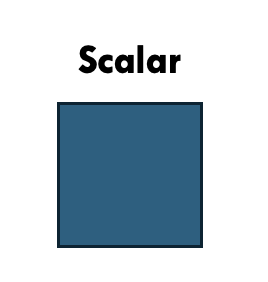

```{r setup, include=FALSE}

library(kableExtra)
library(dplyr)

```

<!--- CSS box customization -->
<style>
p.comment {
background-color: #F9DCC4;
padding: 10px;
border: 1px solid black;
margin: 25px;
border-radius: 5px;
}
</style>


## <span style="color: Tomato;">Conteúdo programático </span> 

<br>

-  **1. Estrutura de dados** 

-  **2. Operadores**  

-  **3. Manipulação de dados**
    - Funções base
    - Dplyr

- **4. Prática no R**

---
class: inverse, center, middle

# Estrutura de dados

---

# Estrutura de dados
## <span style="color: #ee6c4d;">Relembrando </span>


O R opera em estrutura de *dados nomeados*

  -   Também conhecido por __objetos__ ou __variáveis__
    
  -   Armazenamento & manipulação dos dados (ou resultados de análises)
    
--

```{r}

# Operador de atribuição (à esquerda)
obj <- c(1, 2, 3) 


# Operador de atribuição (à direita)
c(1, 2, 3)  -> obj2


# Operador de atribuição (igualdade)
obj3 = c(1, 2, 3)

```


---
# Estrutura de dados
## <span style="color: #ee6c4d;">Classificação dos objetos </span>

Os dados podem ser classificados conforme:

  - Tipo de informação 
    - Variável numérica, discreta, categórica, ... 

<br>

  - Dimensão da informação
    - 1D, 2D, 3D, ....

--

<br>

<p class="comment">
<b> ATENÇÃO: </b> 

<br>

A manipulação do dados depende tanto do tipo de informação que está sendo tratado, como da sua dimensão

</p>


---
# Estrutura de dados
## <span style="color: #ee6c4d;">Classificação dos objetos </span><span style="color: #3e5c76;">| Tipos </span> 

Os dados (i.e., variáveis) podem ser classificados de acordo com a natureza da informação sendo armazenada no objeto

```{r echo=F}


df <- data.frame(
  Variável = c("Integer", "Numeric", "Character", "Factor", "Logical", "Date", "Missing"),
  Tipo = c(
    "Formada por números inteiros",
    "Formada por números com casas decimais",
    "Formada por texto sem categorias e estrutura implícita",
    "Formada por textos com categorias bem definidas",
    "Formado por valores booleanos",
    "Formadas por valores temporais",
    "Não há nenhuma informação atribuída à variável"
  ),
  Exemplo = c(
    paste(c("1", "300", "-60"), collapse = ", "),
    paste(c("3.2", "18.5", "-0.9"), collapse = ", "),
    paste(c("Gato", "Dinamarca", "CNPq"), collapse = ", "),
    paste(c("Manhã", "Tarde", "Noite"), collapse = ", "),
    paste(c("TRUE", "FALSE"), collapse = ", "),
    paste(c("2025", "2025-05-26", "2025-05-26 16:35"), collapse = ", "),
    paste(c("NA (Not Available)"), collapse = ", ")
  )
)

```

```{r, echo =F}

kable(df, format = "markdown",
      caption = "", digits = 3)  %>%
  kable_styling("striped", full_width = F) %>%
  #kable_paper(bootstrap_options = "striped", full_width = F) %>%
  kable_classic() 

```

---
# Estrutura de dados
## <span style="color: #ee6c4d;">Classificação dos objetos </span><span style="color: #3e5c76;">| Tipos </span> 


Pode-se usar a função `class()` para avaliar a natureza do dado:

--

```{r echo=T}

var1 <- c("Olá")
class(var1)

var2 <- pi
class(var2)

var3 <- TRUE
class(var3)

```

---
# Estrutura de dados
## <span style="color: #ee6c4d;">Classificação dos objetos </span><span style="color: #3e5c76;">| Tipos </span> 


Alternativamente, pode-se avaliar se o dado é de uma determinada natureza usando a sintaxe `is.NATUREZA_DO_OBJETO()`:
    
```{r echo=T}
    
## Var1 é de natureza fator?
is.factor(var1)
    
## Var2 é de natureza numérica?
is.numeric(var2)
    
## Var3 é de natureza lógica?
is.numeric(var3)
  
```

---
# Estrutura de dados
## <span style="color: #ee6c4d;">Classificação dos objetos </span><span style="color: #3e5c76;">| Tipos </span> 


De modo similar, é possível alterar a natureza do dado usando funções base conforme:


--
.pull-left[
```{r echo = T}

## Transformando caractere para fator
periodo <- c("Manhã", "Tarde", "Noite")
class(periodo)
periodo <- as.factor(periodo)
class(periodo)

```
]


.pull-right[

**Exemplos**

`as.numeric()`
`as.integer()`
`as.charachter()`
`as.factor()`
`as.logical()`

]


---

# Estrutura de dados
## <span style="color: #ee6c4d;">Classificação dos objetos </span><span style="color: #3e5c76;">| Dimensão </span> 


O dado também pode ser classificado de acordo com sua dimensão
  - Quando contém apenas 1 elemento (1D): 
  
---


# Estrutura de dados
## <span style="color: #ee6c4d;">Classificação dos objetos </span><span style="color: #3e5c76;">| Dimensão </span> 


O dado também pode ser classificado de acordo com sua dimensão
  - Quando contém apenas 1 elemento (1D): 


**Variável atômica (scalar)**

    

.pull-left[

```{r echo=FALSE, out.width ="50%", fig.align ='center'}

```

]

.pull-right[

```{r}

# Isso tudo é um scalar com
# apenas 1 elemento

s1 <- 1 #integer

s2 <- "Oi" #character

s3 <- TRUE #logical

```

]


---
# Estrutura de dados

## <span style="color: #ee6c4d;">Classificação dos objetos </span><span style="color: #3e5c76;">| Dimensão </span> 


O dado também pode ser classificado de acordo com sua dimensão
  - Quando contém +1 elemento: 
    - Classificação passa a depender da dimensão e tipo de dado
      - **Vetor**
      - **Matriz**
      - **Array**
      - **Data frame**
      - **Lista**
    

---
# Estrutura de dados

## <span style="color: #ee6c4d;">Classificação dos objetos </span><span style="color: #3e5c76;">| Dimensão </span> 


### Vetor (1D)

Conjunto de elementos do mesmo tipo (numérico, lógico, caractere etc.)


.pull-left[

```{r echo=FALSE, out.width ="23%", fig.align ='center'}

```

]
.pull-right[

<br>

```{r}

# Vetor numérico
v1 <- c(1, 35, 110)

## Vetor caractere
v2 <- c("A", "B", "C")

## Vetor lógico
v3 <- c(TRUE, TRUE, FALSE)

```

]

---
# Estrutura de dados

## <span style="color: #ee6c4d;">Classificação dos objetos </span><span style="color: #3e5c76;">| Dimensão </span> 


### Matriz (2D)

Representa dados no formato de tabela com linhas e colunas

.pull-left[

```{r echo=FALSE, out.width ="50%", fig.align ='center'}

```

]
.pull-right[

```{r}

m <- matrix(data = letters[1:6], 
            nrow = 2,
            ncol = 3)
m
```

]

---
# Estrutura de dados


## <span style="color: #ee6c4d;">Classificação dos objetos </span><span style="color: #3e5c76;">| Dimensão </span> 

### Array (+2D)
Extensão da matriz para **+2D**


.pull-left[

```{r echo=FALSE, out.width ="60%", fig.align ='center'}

```

]


.pull-right[

```{r}

# Array de 2 matrizes 2x2
a <- array(1:8, dim = c(2, 2, 2))  
a
```
]


---
# Estrutura de dados


## <span style="color: #ee6c4d;">Classificação dos objetos </span><span style="color: #3e5c76;">| Dimensão </span> 

### Data frame (2D)

Similar a uma matriz, porém as colunas podem pertencer à variáveis de naturezas distintas

    
.pull-left[

```{r echo=FALSE, out.width ="60%", fig.align ='center'}

```

]
.pull-right[

```{r}

df <- data.frame(Nome = c("Ana", "Beto"), 
                 Idade = c(25, 16),
                 Maioridade = c(TRUE, FALSE))

df
```

]


---
# Estrutura de dados


## <span style="color: #ee6c4d;">Classificação dos objetos </span><span style="color: #3e5c76;">| Dimensão </span> 

### Lista (+2D)

Coleção de dadaos de qualquer tipo de informação e dimensão (inclusive outras listas)


.pull-left[

```{r echo=FALSE, out.width ="60%", fig.align ='center'}

```

]
.pull-right[

```{r}

l <-  list(rep(1, 10), #vetor
           factor(c("vermelho", "azul", "verde")), #fator
           matrix(c(1, 2), c(1, 2))) #matriz
l
```

]


---

class: inverse, center, middle

# Operadores

---

# Operadores
<br>

São símbolos (ou combinações de símbolos) que realizam operações específicas sobre variáveis

--

  - usados para fazer *cálculos*, *comparações*, e diversos tipos de *manipulações* 


--

- Podem ser agrupados em __4 tipos__ básicos:
  - Aritméticos
  - Relacional
  - Lógico
  - Especiais


---
# Operadores

### <span style="color: Tomato;">Aritmético </span> 

Usados para fazer operações matemáticas

<br>

```{r echo=F}

df2 <- data.frame(Operador = c("+", "-", "*", "/", "^ ou **", "%%", "%/%"),
                 Descrição = c("Adição", "Subtração", "Multiplicação", "Divisão", "Potência", "Resto da divisão", "Divisão inteira"))

```


```{r echo=F}

kable(df2, format = "markdown", align = "cc",
       digits = 3)  %>%
  kable_styling("striped", full_width = T) %>%
  #kable_paper(bootstrap_options = "striped", full_width = F) %>%
  kable_classic() 


```


---
# Operadores

### <span style="color: Tomato;">Relacional </span> 

Usados para comparar valores, retornando TRUE ou FALSE


<br>

```{r echo=F}

df3 <- data.frame(Operador = c(">", "<", ">=", "<=", "==", "!="),
                 Descrição = c("Maior", "Menor", "Maior ou igual", "Menor ou igual", "Igualdade", "Diferença"))

```


```{r echo=F}

kable(df3, format = "markdown", align = "cc",
       digits = 3)  %>%
  kable_styling("striped", full_width = T) %>%
  #kable_paper(bootstrap_options = "striped", full_width = F) %>%
  kable_classic() 
```


---

# Operadores

### <span style="color: Tomato;">Lógico </span> 

Usados para combinar ou inverter valores lógicos (TRUE/FALSE)

<br>


```{r echo=F}

df4 <- data.frame(Operador = c("!", "&", "|"),
                 Descrição = c("Negação (Não)", "E", "OU"))

```


```{r echo=F}

kable(df4, format = "html", align = "cc",escape = FALSE) %>%
  kable_styling("striped", full_width = T) %>%
  #kable_paper(bootstrap_options = "striped", full_width = F) %>%
  kable_classic()
```

---
# Operadores

### <span style="color: Tomato;">Especiais </span> 

<br>

```{r echo=F}

df5 <- data.frame(Operador = c("%in%", ":", "%*%"),
                 Descrição = c("Testa se um elemento pertence a um vetor", "Sequência de números inteiros", "Produto matricial"))

```


```{r echo=F}

kable(df5, format = "markdown", align = "cc",escape = FALSE)  %>%
  kable_styling("striped", full_width = T) %>%
  #kable_paper(bootstrap_options = "striped", full_width = F) %>%
  kable_classic() 
```


---

class: inverse, center, middle

# Manipulação dos dados

---

# Manipulação dos dados
<br>

Os dados podem ser manipulados por diversos motivos e objetivos:
  - Correção de erros (ortográficos, numéricos, ...)
  - Organização
  - Redução (filtragem ou agrupamento)
  - Padronização para realziar certas análises
  - Análise exploratória
  

--

<br>

Há várias formas de manipular os dados:
  - Funções base
  - Funções do pacote `dplyr`


---
# Manipulação dos dados

## <span style="color: #ee6c4d;">O pacote dplyr </span>

.pull-left[

<br>
<br>

```{r echo=FALSE, out.width ="60%", fig.align ='center'}

```

]

.pull-right[

<br>
<br>
<br>
<br>


*"É uma gramática de manipulação de dados, fornecendo um conjunto consistente de verbos que ajudam a resolver os desafios mais comuns de manipulação de dados"*


]


---


# Manipulação dos dados

## <span style="color: #ee6c4d;">O pacote dplyr </span><span style="color: #3e5c76;">| Funções </span>

As principais funções usadas para manipular os dados são:
- `filter()`: filtra linha(s) 
- `select()`: seleciona coluna(s)
- `arrange()`: ordena os dados
- `mutate()`: cria e/ou modifica colunas
- `group_by()`: agrupa os dados
- `summarise()`: sumariza os dados

--

------

Funções especiais:
- `rename()`: renomeia as colunas
- `distinct()`: remove linhas repetidas
- `count() / n()`: contabiliza o número de linhas dentro de cada grupo
- `%>%`: pipe - executa as funções sequencialmente


---

class: inverse, center, middle

# <center> Prática no R </center>


